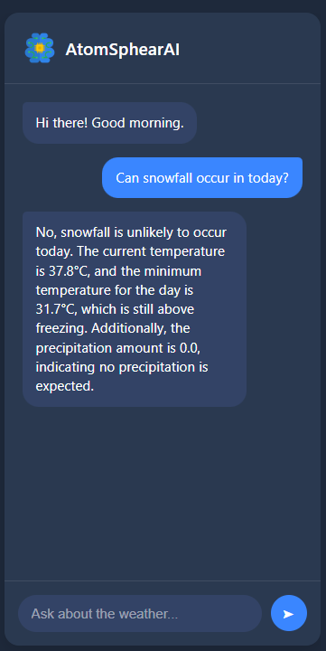

<p float="left">
  
  
</p>

# AtmosphereAI

An advanced machine learning system for atmospheric data analysis and weather prediction.

## Overview

AtmosphereAI is a platform that leverages artificial intelligence to analyze atmospheric data and help your daily life and give smart adivce. Our system combines deep learning models like llama with traditional forecasting methods to deliver accurate and reliable weather predictions.

## Features

- **Real-time Data Processing**: Ingest and process atmospheric data from various sources in real-time
- **Interactive Visualizations**: Explore weather patterns through intuitive and interactive dashboards
- **API Integration**: Seamlessly integrate with other systems through our robust API

## Installation

```bash
#(for windows users only) Install or enable WSL2 from window store
[Windows Subsystem for Linux]( https://apps.microsoft.com/detail/9P9TQF7MRM4R?hl=en-us&gl=IN&ocid=pdpshare )

#Install redis
sudo apt-get install redis

# Clone the repository
git clone https://github.com/AmanSaxena25849/AtmosphereAI.git

# Navigate to the project directory
cd AtmosphereAI

# open .env file 
code .\atmosphereAI\.env

# Add your groq api key.
GROQ_API_KEY = Your_api_key

# Install dependencies
pip install -r requirements.txt

#start redis server in wsl
sudo service redis-server start

# Run the application
python manage.py runserver

#open browser and search
http://127.0.0.1:8000/
```

## Open project next time.
```bash
#Open wsl
wsl

#start redis server in wsl
sudo service redis-server start

#navigate to project directory in new terminal
cd (directory where you put the project)\atmosphereAI

# Run the application
python manage.py runserver

#open browser and search
http://127.0.0.1:8000/
```


## Project Structure

```
AtmosphereAI/
├── atmosphereAI
│   ├── asgi.py
│   ├── chatbot.py
│   ├── geocoding.py
│   ├── __init__.py
│   ├── __pycache__
│   │   ├── chatbot.cpython-310.pyc
│   │   ├── forms.cpython-310.pyc
│   │   ├── geocoding.cpython-310.pyc
│   │   ├── __init__.cpython-310.pyc
│   │   ├── settings.cpython-310.pyc
│   │   ├── urls.cpython-310.pyc
│   │   ├── views.cpython-310.pyc
│   │   ├── weather.cpython-310.pyc
│   │   └── wsgi.cpython-310.pyc
│   ├── settings.py
│   ├── urls.py
│   ├── views.py
│   ├── weather.py
│   └── wsgi.py
├── db.sqlite3
├── logo
│   └── Untitled design.png
├── manage.py
├── README.md
├── requirements.txt
├── static
│   ├── AI.png
│   ├── atmoSphereAI.css
│   ├── atmoSphereAI.js
│   ├── location.png
│   └── profile_pic.jpg
└── templates
    ├── atmoSphereAI.html
    └── partials
        ├── chatbot.html
        └── search_list.html
```

## Technologies

- Python 3.9+
- Django
- Redis
- Open-meteo API
- Groq Llama 3 AI model


## Contact

**Aman saxena**
- Email: amansaxena25849@gmail.com
- Linkedin: https://www.linkedin.com/in/aman-saxena-949bb9322/
- Live Demo(vercel): https://atmosphere-ai.vercel.app/
- Live Demo(render): https://atmosphereai.onrender.com/
- Project Link: [https://github.com/AmanSaxena25849/AtmosphereAI](https://github.com/AmanSaxena25849/AtmosphereAI)


## Acknowledgments

- [Open-Meteo](https://open-meteo.com/) for providing weather data.
- [GeoPy](https://pypi.org/project/geopy/) for geolocation data.
- [Groq](https://groq.com/) for Llama AI model.
- [Icon8](https://icons8.com/) for awesome icons.
- All contributors who have helped build and improve AtmosphereAI
